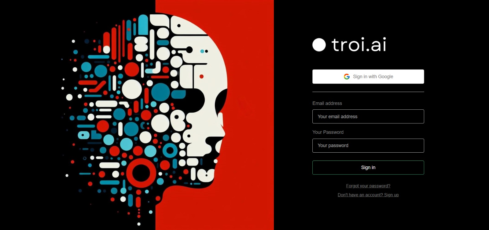
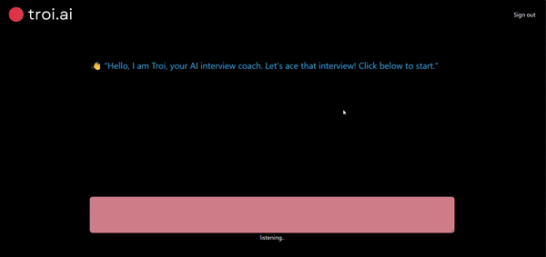

# Troi.AI - AI Interview Simulator

Troi.AI is an AI-powered interview simulator designed to provide a conversational interface for interview practice. By submitting the job description and resume, the system initiates interview-like interactions using both audio and text formats.

## Features

- **Chat Interface:** Engage in interview-like conversations through text and voice inputs.
- **AI Questioning:** Utilizes AI algorithms to generate interview questions based on submitted job descriptions and resumes.
- **Audio Interaction:** Offers voice-based interaction for answering questions.
- **Typing Support:** Allows candidates to respond to questions through typing.

### Usage

1. **Submit Job Description and Resume:** Provide the necessary details to initiate the interview simulation.
2. **Engage in Interview:** Answer questions posed by Troi.AI using either voice or text input.
3. **Review Performance:** Get feedback on your answers and performance during the simulation.

## Login Page

## Main page

## Contributing
Contributions to enhance the functionality, accuracy, or expand the knowledge base of Medezy are welcome! Feel free to submit pull requests, report issues, or suggest improvements.
